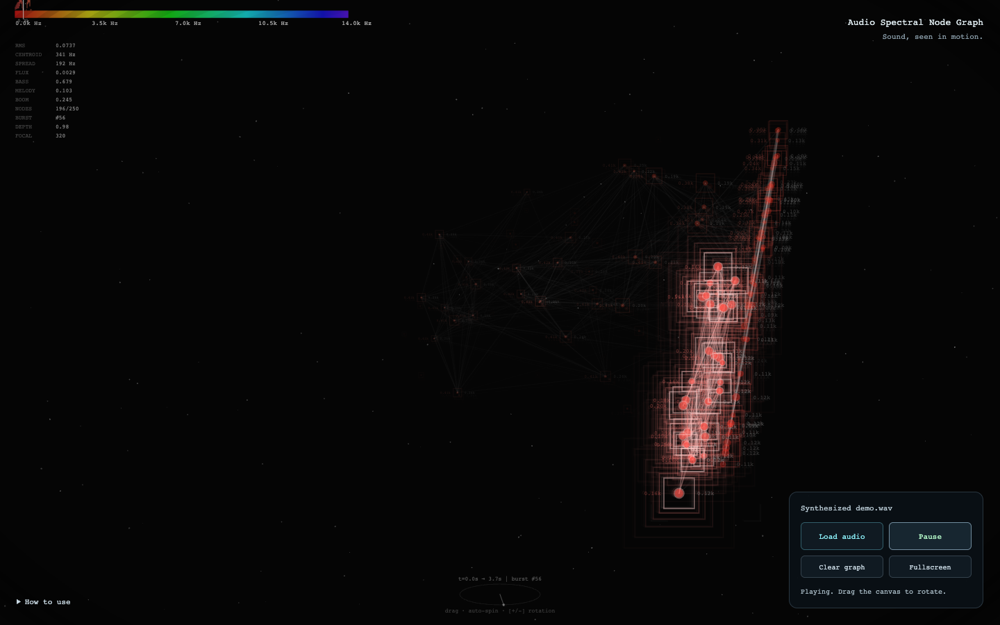

# Audio Spectral Node Graph

An interactive audio visualizer that turns your music into a moving graph of spectral features. Built with **p5.js**, **p5.sound**, and the **Web Audio API**.

**[Open the web app](https://arthifact.github.io/audio_spectral_node_graph/)** · [Contributing](CONTRIBUTING.md)



## Try it

1. Open the web app and choose **Load audio**, or drop an audio file onto the page.
2. Press **Play**. MP3 and WAV are good starting points; other formats depend on your browser.
3. Drag the canvas to rotate the graph. Pause at any time, or use **Clear graph** to start a fresh visual history without restarting the track.

Your audio is decoded and analyzed on your device. It is never sent to a server. No account, microphone access, or music library is required.

## What you see

Each node represents a short moment of sound. Spectral centroid controls its color, RMS amplitude controls its size, and centroid, spread, and a low/high spectral balance place it in a rotating spatial view. Nearby moments connect into trails. Changes in spectral content trigger new bursts; bass energy drives additional motion.

The spectrum bar and desktop readout show live features. The scene is an expressive visualization with smoothing, adaptive bounds, and artistic motion rather than a calibrated audio measurement instrument.

| Control                  | Action                             |
| ------------------------ | ---------------------------------- |
| Load audio / drop a file | Choose audio from your device      |
| Play / Space             | Play or pause                      |
| Clear graph / C          | Clear nodes and analysis history   |
| Drag the canvas          | Rotate the scene                   |
| Fullscreen / F           | Enter or exit fullscreen           |
| + / −                    | Shift the automatic rotation phase |

## Run locally

Requires Node.js 22 or newer.

```sh
git clone https://github.com/arthifact/audio_spectral_node_graph.git
cd audio_spectral_node_graph
npm ci
npm start
```

Open <http://127.0.0.1:8000>. The development preview loads pinned p5.js libraries from jsDelivr. The deployed build includes these libraries locally and needs no CDN.

## Project structure

```text
index.html          Accessible controls and app shell
style.css           Responsive interface styles
src/
  config.js         Visual and analysis settings
  audio.js          File decoding and playback lifecycle
  ui.js             Controls and drag-and-drop events
  spectral.js       Pure spectral feature calculations
  viewport.js       Graph framing for narrow screens
  sketch.js         p5 lifecycle, scene state, camera, and rendering
scripts/
  serve.js          Local static preview
  build.js          Standalone deployment output
tests/              Spectral tests and browser interaction checks
.github/workflows/  Validation and GitHub Pages deployment
```

Tune the scene in `src/config.js`. Analysis defaults to 1,024 FFT bins and 40 overlapping mel-spaced ranges. These ranges use averaged byte magnitudes and peak normalization; they are not MFCCs or a triangular mel filterbank. Frequency conversions use the browser audio context's actual sample rate.

## Development

```sh
npm run check               # Formatting and JavaScript syntax
npm test                    # Spectral calculations with known inputs
npx playwright install chromium
npm run test:browser        # Local file loading, playback, errors, and narrow layout
npm run build               # Static site in dist/
```

See [CONTRIBUTING.md](CONTRIBUTING.md) for the workflow and deployment details.

## Browser notes

Use a browser with Web Audio and ES module support. Playback starts after a user action. Codec and fullscreen support vary by browser. Large files are decoded in memory; use a shorter track if loading is slow. Visual performance depends on screen resolution and node count.

## Credits

Project by [arthifact](https://github.com/arthifact). Uses [p5.js](https://p5js.org/) and [p5.sound](https://p5js.org/reference/p5.sound/). A project code license has not yet been selected; third-party libraries retain their own licenses.
